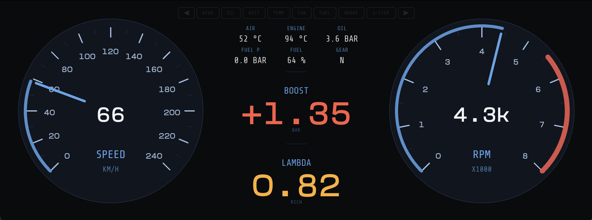
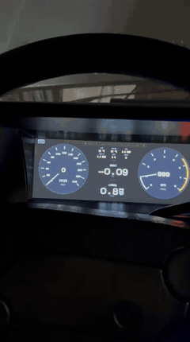
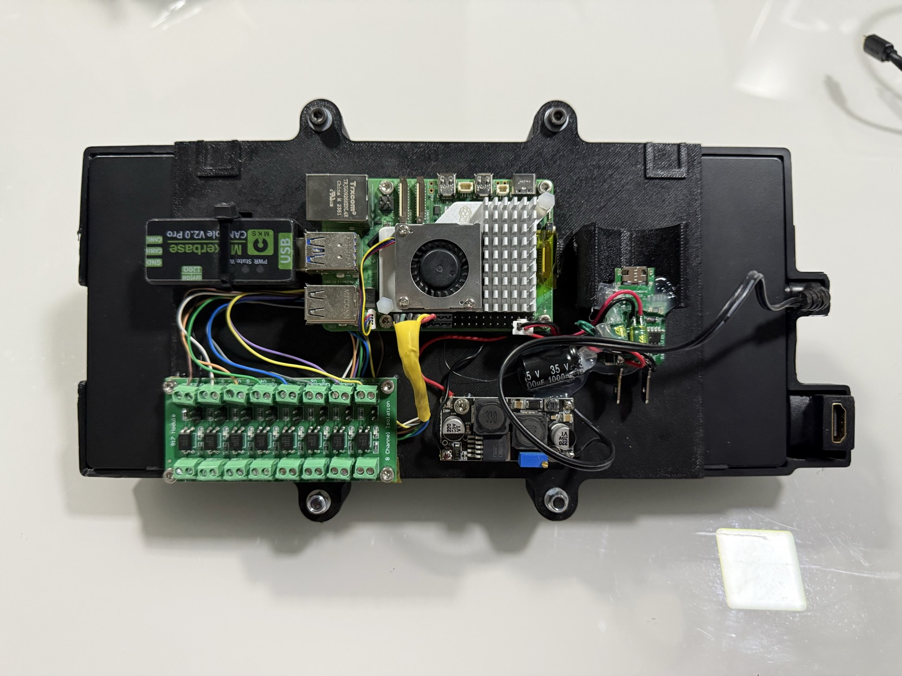
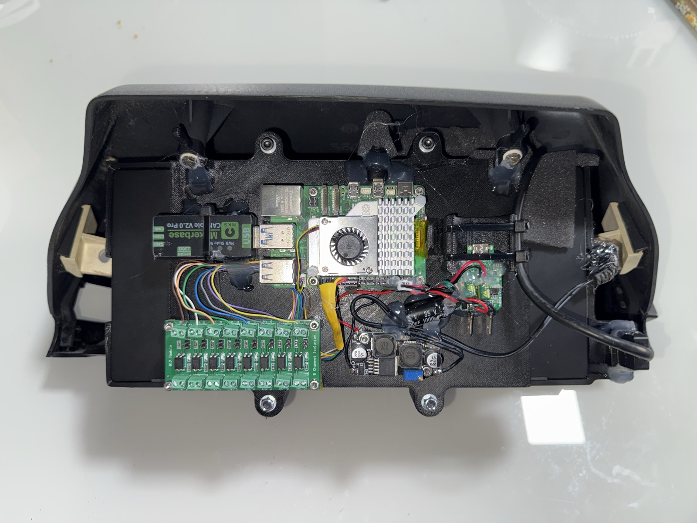

# CAN Cluster

*A custom digital gauge cluster for a turbo 1992 VW Gol G1 — Raspberry Pi · FuelTech CAN · Kivy.*

It reads engine data from a **FuelTech ECU over CAN** (FTCAN 2.0) and dashboard switches over
**GPIO**, and renders a minimal dark dashboard on a cheap 1920×720 display driven by a
**Raspberry Pi**. The whole thing runs headless off the car's ignition power and is designed to
survive being cut off mid-frame (see [Deploying](#deploying-to-the-pi)).

The styling is a minimal, period-with-a-cyber-edge look anchored on the car's "Azul Boreal" blue
(modelled on a Claude Design mockup, *Painel Gol Minimal*): hairline analog gauges, a no-box
centre readout, and tell-tale "pills" that stay dark until they have something to say.



Running in the car ([full video](docs/cluster-demo.mp4)):



## What it shows

- **Two analog gauges** — speed (left) and RPM (right): hairline major/minor ticks, a thin
  Azul Boreal needle and progress arc, redline arc, and a centre digit (RPM shows `3.2k`-style
  above 1000). A startup self-test sweep runs on boot.
- **Shift light** — above 6000 rpm the RPM gauge flashes aggressively: red disc wash, fat amber
  arc + needle, steady red `SHIFT!`.
- **Centre readout** (no box) — AIR / ENGINE / OIL / FUEL micro-grid, then big **BOOST** and
  **LAMBDA** with colour cues (lambda RICH/STOICH/LEAN, boost red over 1.32 bar).
- **Tell-tales** — a top row of pills: turn signals (◄ ►), HIGH beam, CHOKE, OIL, TEMP, FAN,
  FUEL, BRAKE, 2-STEP, etc. Plus a standalone **WIFI** pill (top-left, hidden unless connected).
- **No-CAN demo mode** — after ~3 s with no CAN frames (on a bench), an animated drive loop
  plays so the cluster is alive without the car. Real data takes over the moment it appears.

## Hardware

- **Raspberry Pi 5** running **Armbian** (Debian bookworm), displaying full-screen via Kivy on
  SDL2 / KMS-DRM (no desktop environment).
- A 10.3" **1920×720** display.
- A **CANable V2.0 Pro** USB↔CAN adapter (socketcan, `can0`) connecting the Pi to the
  **FuelTech ECU**, which broadcasts FTCAN 2.0.
- An **8-channel optocoupler board** isolating the car's dashboard switches (turn signals, high
  beam, choke, parking brake, …) before they reach the Pi's **GPIO**, so 12 V automotive signals never
  touch the 3.3 V pins.
- A **buck converter** stepping the car's 12 V down to 5 V for the Pi.
- Everything mounted in a 3D-printed enclosure behind the display.

The complete build, seen from the back — Pi 5 (centre), CANable adapter (top-left), optocoupler
board (bottom-left) and buck converter (centre):



The whole assembly drops into the **original VW Gol G1 instrument cluster housing** — the OEM
dash plastic is reused as the enclosure, so it fits the car's binnacle exactly:



## How it works

```
CAN thread  (can_helper.read_can) ┐
                                  ├─► SensorState ─► Dashboard.update() @30Hz ─► widgets
GPIO thread (gpio_helper.read_io) ┘
```

`SensorState` (in `model.py`) is a thread-safe `@dataclass` shared between the reader threads and
the Kivy render loop. The CAN thread calls `state.update({...})` for each decoded frame; the GPIO
thread updates `state.io`. The dashboard reads the state 30×/s and pushes values into the widgets.
Because rendering only ever *reads* a snapshot of the state, a slow or silent sensor never stalls
the UI.

### Project layout

```
cluster.py          Kivy app: Dashboard + CarClusterApp; window/gauge config; render loop + demo
start_cluster.py    Production entry point — spawns CAN + GPIO reader threads, runs the app
model.py            SensorState / IoState — the thread-safe shared data model
can_helper.py       read_can(): decode the FTCAN 2.0 tagged real-time broadcast into SensorState
gpio_helper.py      read_io(): read GPIO pins into SensorState.io (+ change-logging)
demo.py             simulate(t): the drive simulation used by no-CAN demo mode
theme.py            All colours and layout constants
widgets/
  gauge.py          The analog Gauge (ticks, needle, arc, shift light)
  center_info.py    The centre readout (CenterInfo) — micro-grid + BOOST/LAMBDA
  top_alerts.py     TopAlerts: the tell-tale pill row + WiFi pill (TellTale)
  readout.py        Small value-with-threshold-colour helper
fonts/              Bundled fonts (Share Tech Mono, Compagnon, …)
deploy.sh           Deploy to the Pi and manage its read-only overlay
logs.sh             Tail the running cluster's logs from the Pi
```

## Running

Dependencies are managed with **Poetry** (Python ≥3.10, Kivy, python-can, …).

```bash
poetry install

# Desktop preview (no CAN/GPIO): windowed, and it self-animates the demo loop
poetry run python cluster.py

# Full run with CAN + GPIO reader threads (on the Pi)
poetry run python start_cluster.py
```

`DEV` (env var, default `true`) gives a half-size preview window. On the Pi, production runs with
`DEV=false` for the full 1920×720 window. The no-CAN demo is independent of `DEV` — it triggers
whenever no CAN frame has arrived for a few seconds.

On the Pi the app is a **systemd service**, `can-cluster.service`, which runs
`/usr/local/bin/start-can-cluster.sh` (sets the Kivy/KMS env, `cd`s to the project, runs
`start_cluster.py`).

## Deploying to the Pi

The car cuts power to the Pi the instant the ignition goes off, so the root filesystem is kept
**read-only** in normal use (Armbian *overlayroot* — writes go to RAM and are discarded on power
loss). That way an ignition-off power cut can never corrupt the SD card. The `deploy.sh` script
handles the writable↔read-only cycle and the reboots it requires:

```bash
./deploy.sh          # make writable → sync the repo → re-enable read-only (ends power-safe)
./deploy.sh --no-ro  # deploy but leave it writable (iterating); ./deploy.sh --ro when done
./deploy.sh --rw     # just switch to read-write
./deploy.sh --ro     # just switch to read-only
./deploy.sh --status # report the current mode
```

Connection settings default to `192.168.0.153` / `lucas` / `lucas` and are overridable via
`PI_HOST` / `PI_USER` / `PI_PASS`. Requires `sshpass` locally (`brew install sshpass`), or set up
an SSH key (`ssh-copy-id`) and it works passwordless. Read-only is toggled by an
`overlayroot=tmpfs` token in `/boot/firmware/cmdline.txt` (on the always-writable FAT partition,
so it's recoverable by mounting the SD card on any computer).

> **Always finish with the Pi read-only.** After any `--no-ro` / `--rw` iteration, run
> `./deploy.sh --ro` so the next ignition-off can't corrupt the card.

## Logs

The app is headless, so the systemd journal is the way to check on it:

```bash
./logs.sh          # follow all cluster logs live
./logs.sh gpio     # follow only the [gpio] pin lines (handy for finding wiring)
./logs.sh 100      # last 100 lines and exit
```

## Wiring a GPIO switch to a tell-tale

Three names have to line up:

1. **`gpio_helper.py`** — a `Pin` enum entry, e.g. `PARKING_BRAKE = 5` (name = BCM pin).
2. **`model.py`** — an `IoState` field with the **same name lowercased**, e.g. `parking_brake: bool`.
   (`IoState.update()` drops any reading whose pin name has no matching field.)
3. **`widgets/top_alerts.py`** — in `set_state`, point a pill key at it (`"brake": io.parking_brake`),
   and make sure a matching entry exists in `PILLS`.

Then `./deploy.sh`. To discover which physical switch is on which pin, run `./logs.sh gpio` and
flip switches one at a time — the pin that logs `-> ON` is the one.

## Decoding FTCAN 2.0

`can_helper.py` decodes FuelTech's **real-time tagged broadcast** — the self-describing stream
where each frame carries `(measure, value)` pairs rather than a fixed field layout. This is the
hard part of the project, so it's worth spelling out.

**The bus.** A FuelTech ECU broadcasts on a 1 Mbit/s bus using **29-bit extended** CAN IDs. The
real-time reading broadcast is the family whose *MessageID* (the CAN ID's low byte) is `0xFF`, so
the listener subscribes to exactly that family at the socket level and lets the kernel drop
everything else:

```python
filters = [{"can_id": 0x000000FF, "can_mask": 0x000000FF, "extended": True}]
```

Every FuelTech device on the wire (ECU, wideband, …) broadcasts here, so one listener sees them
all without caring which node a measure came from.

**Measures.** The payload is a sequence of 4-byte pairs — `MeasureID` (2 bytes) then `Value`
(2 bytes), both **big-endian**. The MeasureID packs a data id and a status bit together:

```
MeasureID = (DataID << 1) | status_bit     ⇒   DataID = mid >> 1
```

`DataID` is the catalogue number of the quantity (`0x0042` = RPM, `0x0002` = MAP, …); the low bit
is a per-measure status flag. Values are decoded as **signed 16-bit** (two's complement) so
vacuum (negative MAP) and sub-zero temperatures come through correctly, then scaled by a
per-DataID multiplier from `MEASURE_MAP` — e.g. MAP arrives in `mbar`-ish counts and is scaled by
`0.001` to bar, RPM is `×1`. A handful of DataIDs aren't plain numbers and are special-cased: gear
is a *signed* index mapped to a label (`-1 → "R"`, `0 → "N"`, …), launch mode is "nonzero = 2-step
armed", and a tentative day/night id drives the display dimming.

**Three frame layouts.** Which layout a frame uses is encoded in its *DataFieldID* — bits 11–13 of
the CAN ID, `(cid >> 11) & 0x7`:

| Layout | How to tell | Payload |
| --- | --- | --- |
| **Standard CAN** | `DataFieldID == 0` | the 8 data bytes *are* `(MeasureID, Value)` pairs |
| **FTCAN single packet** | first byte `0xFF` | pairs follow the `0xFF` marker |
| **FTCAN segmented** | first byte is a segment index | reassemble across frames (below) |

**Segmented reassembly.** A burst that doesn't fit in 8 bytes is split across frames. Segment `0`
opens with a 2-byte **total length** followed by the start of the payload; each continuation frame
appends its bytes (after its 1-byte index); once the buffer reaches the declared length it's sliced
back to size and parsed into pairs. The reassembly buffer is keyed per CAN ID, so interleaved
multi-frame messages from different devices don't corrupt each other:

```python
elif b0 == 0x00:                    # segment 0: [total_len:2][payload…]
    total = (data[1] << 8) | data[2]
    seg[cid] = [total, bytearray(data[3:])]
elif cid in seg:                    # continuation: append, flush when complete
    seg[cid][1] += bytes(data[1:])
    total, buf = seg[cid]
    if len(buf) >= total:
        _pairs(bytes(buf[:total]), out)
        del seg[cid]
```

Decoded measures are merged into `SensorState` in one locked `update()` (which also stamps the
CAN-activity clock that gates demo mode), so the render loop only ever sees whole, consistent
frames.

**Discovery.** Not every signal is mapped yet — the radiator-fan output (an ECU **output bitmask**,
not a named measure) and a few status bits still need to be identified on the live car. `can_helper.py`
ships a `log_realtime()` logger that prints every real-time DataID **on change** (tag `[canrt]`), and
`decode_dump.py` does the same against a saved capture (`dump.txt`) — flip the fan, watch which
DataID/bit moves, then add it to `MEASURE_MAP`. The protocol itself is documented in
`Protocol_FTCAN20.pdf` (image-only; render the pages with `pdftoppm -png` to read the measure table).

## Status

Personal project, no warranty. Made to run on a Raspberry Pi with a FuelTech ECU — the pin map and
a few tell-tales (fan, 2-step) are still being wired up on the real car.
</content>
</invoke>
